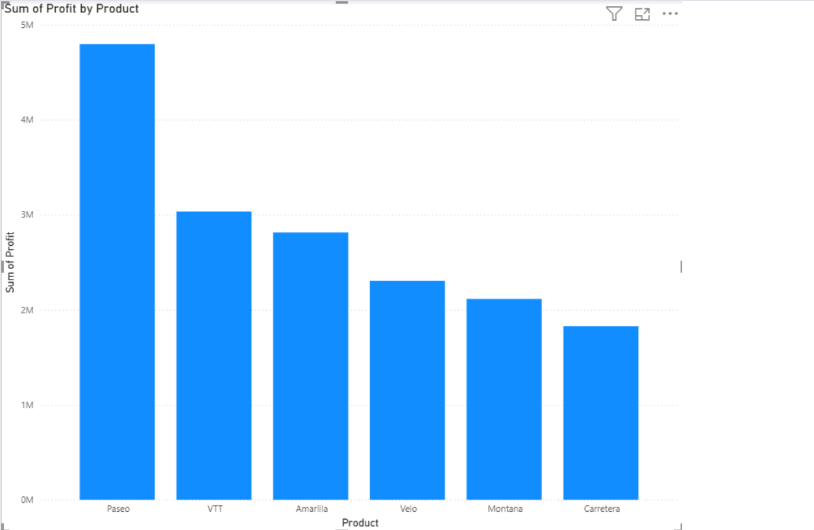
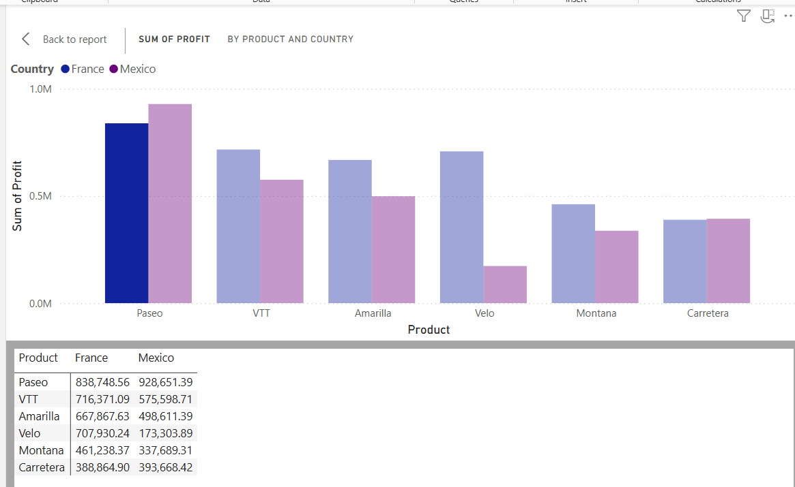
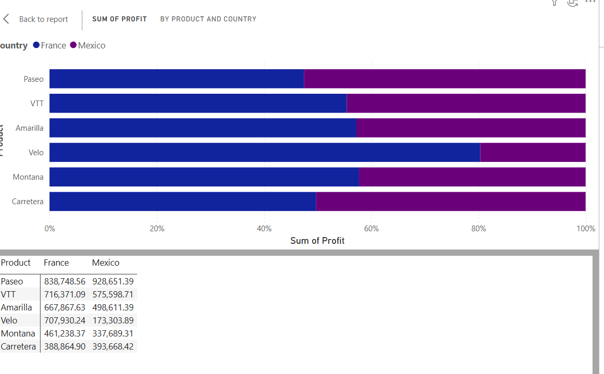
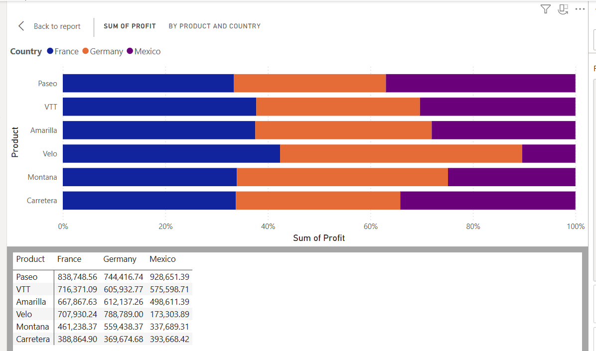
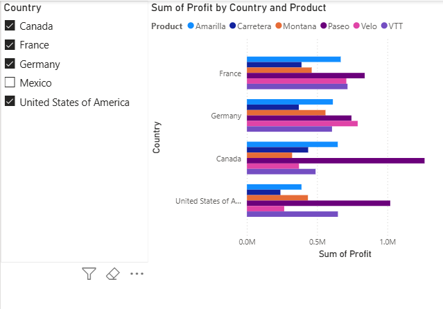

# 📊 Data Analytics Portfolio

## 👋 About Me
Hi, I'm Roberta. I'm an aspiring Data Analyst based in the UK, currently building my skills in **Power BI, SQL, and Python**. This portfolio showcases my hands-on projects as I work towards a Junior Data Analyst role.

## 📈 Power BI Dashboards

| Project | Description |
| :--- | :--- |
| Profit by Product | Profit per product - overview |
| France vs Mexico (Table) | Exact values comparison France vs Mexico |
| France vs Mexico (%) | Percentage share per country |
| France, Germany, Mexico | 3-country comparison |
| All Countries Matrix | Complete view all countries and products |

## 🗃️ SQL Queries

| File | Description |
| :--- | :--- |
| *Coming soon* | Sales data extraction with joins and aggregation |
| *Coming soon* | Customer segmentation queries |

## 🐍 Python (Coming soon)
- Data cleaning with pandas
- Exploratory Data Analysis (EDA)

## 🛠️ Tools
- **Power BI Desktop** – Interactive dashboards and data modelling
- **SQL Server / SSMS** – Querying and database management
- **VS Code** – Code editor for SQL and Python
- **Git & GitHub** – Version control and portfolio hosting

## 📫 Let's connect
- [GitHub](https://github.com/RobertaAlvesUK)
- [LinkedIn](https://www.linkedin.com/in/roberta-alves-8205661b8)
- 📧 robertabrasil24@gmail.com

---
*📅 Last updated: May 2026*

